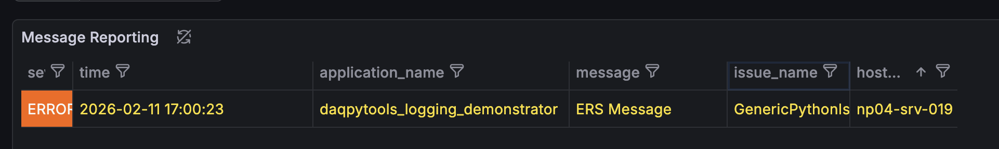
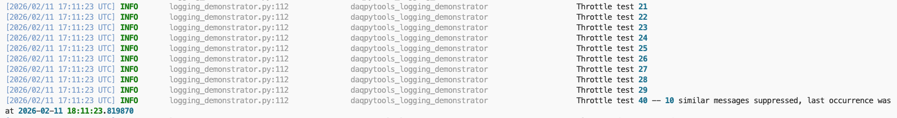
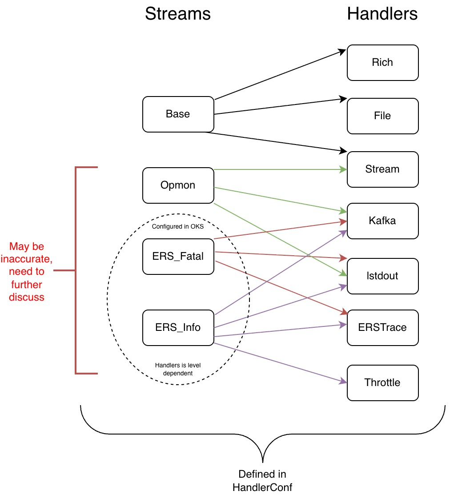

# Logging for Python in DUNE-DAQ
Updated as of 5.6.0

Welcome, fellow beavers! This page provides a user guide to logging in Python in the context of DUNE-DAQ.

For advanced routing and expert configuration patterns, see `docs/Logging_advanced.md`.

## Basics

The bulk of the logging functionality in drunc and other Python applications is built on the [Python logging framework](https://docs.python.org/3/library/logging.html), with its mission defined below:

> This module defines functions and classes which implement a flexible event logging system for applications and libraries.

It is worth reading to understand how logging works in Python; the salient points are covered below.

In general, the built-in logging module allows producing severity-classified diagnostic events, which can be filtered, formatted, or routed as necessary. These logs automatically contain useful information including timestamp, module, and message context.

The core object in Python logging is the logger. A logging instance, `log`, can be initialized as follows. The phrase "Hello, World!" is bundled with other useful metadata, including severity level, to form a `LogRecord`, which is then emitted as required.

```python
import logging
log = logging.getLogger("Demo")
log.warning("Hello, world!")

>> Hello, World!
```

### Severity levels

Every record has an attached severity level, which can be used to flag how important a log record is. By default, Python has 5 main levels and one 'notset' level as shown in the image below[^1]:


[^1]: more can be defined as required, see Python's logging manual.

Each logging instance can have an attached severity level. If it has one, then only records that have the same severity level or higher will be transmitted.

```python
import logging
log = logging.getLogger("Demo", level = logging.WARNING)

log.info("This will not print")
log.warning("This will print")

>> This will print
```

### Handlers

Handlers are a key concept in Python logging, since they control how records are processed and formatted. DAQ uses several standard handlers as well as custom handlers.

The image below shows a file handler, a stream handler, and a webhook handler. Each record is processed and formatted by each handler and then transmitted through that destination.


Importantly, each handler can have its own associated severity level! In the example above, it is certainly possible to have the WebHookHandler to only transmit if a record is of the level Warning or higher.


### Filters
Filters are an important add-on for loggers, and their primary purpose is to decide whether a record should be transmitted. Filters can be attached to both a logger instance and its handlers.

When a log record arrives, it is first processed by filters attached to the logger. If it passes, the record is then passed to each handler and processed again by that handler's filters. A record is emitted only if those checks pass.


### Inheritance

Another key part of Python logging is inheritance. Loggers are organized hierarchically, so you can initialize descendant loggers by chaining names with periods, such as "root.parent.child".

By default, loggers inherit certain properties from the parent:
- severity level of the logger 
- handlers (and all attached properties, including severity level and filters on handlers)


Note one exception: they _do not_ inherit filters attached directly to the parent logger itself.

A useful diagram is the [logging flow in the official Python 3 docs](https://docs.python.org/3/howto/logging.html#logging-flow).


## Using logging with daqpytools

The [daqpytools](https://github.com/DUNE-DAQ/daqpytools) package contains several quality-of-life improvements for DAQ Python tooling, including logging utilities.

These include:
- standardised ways of initialising top-level 'root' loggers
- constructors for default logging instances
- many bespoke handlers 
- filters relevant to the DAQ
- handler configurations


A lot of these features can be demonstrated via the logging demonstrator functionality. With the DUNE environments loaded, simply run 

```
daqpytools-logging-demonstrator
```

and view the help string to learn more, and view the script itself in the repository to see how it is implemented. 


### Initializing a logger

Initializing a logger instance is simple:

```python
from daqpytools.logging import get_daq_logger
test_logger = get_daq_logger(
    logger_name = "test_logger",
    log_level = "INFO",
    use_parent_handlers = True,
    rich_handler = True,
    stream_handlers = False
)

test_logger.warning("Hello, world!")
```

As shown above, initializing a logger with specific handlers is as easy as changing constructor flags.


The core philosophy of the logging framework in daqpytools is that each logger should only have _one_ instance of a specific type of logger. This means that while a single logger can have both a Rich and a Stream handler, a single logger cannot have _two_ Rich handlers to prevent duplicating messages.


Please refer to the docstrings for the most up to date definitions on the options and what handlers may or may not be included. There are some exceptions which are clearly labelled in the document. Choosing which handler to trigger on a per-message instance is an advanced feature of logging in DUNE-DAQ, so please refer to the advanced section of this guide. 

Alternatively, it is possible to add handlers to an existing DAQ logger instance. Please also refer to the advanced section of this guide.


### Walkthrough of existing handlers and filters

As seen in the previous section, there are several handlers and filters available in daqpytools. What follows is a short description of each, with quick examples. For complete details, refer to docstrings and the logging demonstrator.

Remember that by default, any messages received by the logger will be transmitted to _all_ available handlers that are attached to the logger. 


#### Rich handler

The Rich handler should be the 'default' handler for any messages that should be transmitted in the terminal. This handler has great support of colors, and delivers a complete message out to the terminal to make it easy to view and also trace back to the relevant message. 


#### File handler

As the name suggests, the file handler is used to transmit messages directly to a log file. Unlike stream and rich handlers, instead of defining a boolean in the constructor the user must supply the _filename_ of the target file for the messages to go into.


#### Stream handlers

Stream handlers are used to transmit messages directly to the terminal without any color formatting. This is of great use for the logs of the controllers in drunc, which has its own method of capturing logs via a capture of the terminal output and a pipe to the relevant log file. 

Note that stream handling consists of two handlers, one writing to `stdout` and one to `stderr`. The `stderr` stream emits only for records at `ERROR` or above.


#### ERS Kafka handler

The ERS Kafka handler is used to transmit ERS messages via Kafka, which is incredibly useful to show on the dashboards messages as they happen. 

This handler is not included in the default emit set. Extra configuration is required; for example:

```python
import logging

from daqpytools.logging import HandlerType, get_daq_logger

main_logger: logging.Logger = get_daq_logger(
    logger_name="daqpytools_logging_demonstrator",
    ers_kafka_session="session_tester"
)

main_logger.error(
    "ERS Message",
    extra={"handlers": [HandlerType.Protobufstream]} 
)
```

See the advanced section for more details.



**Notes**
At the moment, by default they will be sent via the following:
```
session_name: session_tester
topic: ers_stream
address: monkafka.cern.ch:30092
```


#### Throttle filter

There are times when an application decides to send a huge amount of logs of a single message in a very short time, which can overwhelm the systems. When such an event occurs, it is wise to throttle the output coming out. 

The throttle filter replicates the same logic that exists in the ERS C++ implementation, which dynamically limits how many messages get transmitted. The filter is by default attached to the _logger_ instance, with no support for this filter being attached to a specific handler just yet. 

Initializing the filter takes two arguments:
 - `initial_treshold`: number of initial occurrences to let through immediately
 - `time_limit`: time window in seconds for resetting state

The basic logic is as follows. 

1. The first N messages will instantly get transmitted, up to `initial_treshold`
2. The next 10 messages will be suppressed, with the next single message reported at the end
3. The next 100 messages will be suppressed, with the next single message reported at the end
4. This continues, with the threshold increasing by 10x each time
5. After `time_limit` seconds after the last message, the filter gets reset, allowing messages to be sent once more


For the throttle filter, a 'log record' is **uniquely** defined by the record's pathname and linenumber. Therefore, 50 records that contain the same 'message' but defined in different line numbers in the script will not be erroneously filtered.


An example is as follows:

```python
import time

from daqpytools.logging import HandlerType, get_daq_logger

main_logger: logging.Logger = get_daq_logger(
    logger_name="daqpytools_logging_demonstrator",
    stream_handlers=True,
    throttle=True
)

emit_err = lambda i: main_logger.info(
    f"Throttle test {i}",
    extra={"handlers": [HandlerType.Rich, HandlerType.Throttle]},
)

for i in range(50):
    emit_err(i)
main_logger.warning("Sleeping for 30 seconds")
time.sleep(30)
for i in range(1000):
    emit_err(i)
```

Which will behave as expected.

 

**Note**
By default, throttle filters obtained via `get_daq_logger` are initialized with an `initial_treshold` of 30 and a `time_limit` of 30.

**Note**
Similarly to the ERS Kafka handler, this filter is not enabled by default, hence requiring the use of HandlerTypes. See the Advanced section for more info.

### Operational gotchas

This section captures the most common pitfalls that come up in real applications.

1. Logger names are treated as identities.
If a logger already exists and you call `get_daq_logger` again with a different
handler configuration, construction will fail. Reuse the same configuration for that
name, or choose a new logger name.

2. `setup_root_logger` is strict.
If the named root logger already has handlers attached, setup will fail instead of
silently reconfiguring that logger.

3. `throttle=True` only installs the filter.
Throttle behavior is applied only when `HandlerType.Throttle` is in the resolved
allowed handler set for the record (for example in `extra={"handlers": [...]}` or
in stream-based routing metadata).

4. ERS routing is level-mapped.
ERS routing is keyed from Python levels to ERS env vars for
`INFO`, `WARNING`, `ERROR`, and `CRITICAL`.
Messages at levels without ERS mapping (for example Python `DEBUG`) will not route
to ERS handlers through the ERS strategy.

5. ERS env vars must exist when ERS is initialized.
Calling ERS initialization without required `DUNEDAQ_ERS_*` vars results in
configuration errors.

6. Only one protobuf endpoint is supported in Python ERS setup.
If ERS env parsing yields multiple distinct `protobufstream(url:port)` endpoints,
setup will fail.

### Advanced logging

The walkthrough above is sufficient for most usage.

For advanced topics, including:

- initializing handlers on an existing logger
- suppress-by-default fallback behavior with `HandlerType.Unknown`
- configuring ERS handlers with `setup_daq_ers_logger`
- `**kwargs` propagation to handler/filter factories

see `docs/Logging_advanced.md`.

#### Choosing handlers with HandlerTypes 

Let's say you have a logger with an attached Rich handler and File handler, and two messages to log. One should only go to file, and the other should only go to terminal via rich.

```
log = get_daq_logger("example", rich_handler=True, file_handler_path="logging.log")
```

These can be done by using the `HandlerTypes` enum. The loggers defined here have a special ability to read which HandlerTypes are supplied and to only transmit to the required handlers. 

There is a very specific syntax that must be followed involving the `extra` kwarg:

```
from daqpytools.logging import HandlerType

log.info("This will only be sent to the Rich", extra={"handlers": [HandlerType.Rich]})
log.info("This will only be sent to the File", extra={"handlers": [HandlerType.File]})
log.info("You can even send to both", extra={"handlers": [HandlerType.Rich, HandlerType.File]})
```

Naturally, asking the logger to emit to a handler type that is not attached is a no-op. In the example above, using `HandlerType.Stream` would do nothing.


#### The need for handler streams

Within the DUNE DAQ ecosystem, there are several other configurations that interplay. These include the OpMon and ERS, which require several handlers for each configuration. These can be best thought of as 'streams' which interact with several other handlers, as shown in an example below.



The native implementation in drunc and most applications is referred to as the Base stream, which interacts with Rich, File, and Stream handlers. **This is why the ERS Kafka handler and the Throttle filter need to be activated with HandlerTypes**.

The ERS configuration is defined in OKS, [for example here](https://github.com/DUNE-DAQ/daqsystemtest/blob/974965be6e96aff969c69a380ed34aa96705e802/config/daqsystemtest/ccm.data.xml#L189), and are automatically parsed by daqpytools as they get used. A special feature of the ERS configuration is that the relevant Handlers are severity-level dependent; ERS Fatal and ERS info may have a different set of handler requirements

#### Log Handler Conf


To deal with the constraints set above, a handler configuration dataclass called `LogHandlerConf` is constructed to define the relevant configurations and a system of filters is initialised with every handler. When passing a log record that needs to be processed via a specific stream, the log record and the handler configuration is passed to the relevant logger, after which it is processed. 

An example of which is shown in the logging demonstrator, copied here.

```python
handlerconf = LogHandlerConf()

main_logger.warning("Handlerconf Base", extra=handlerconf.Base)
main_logger.warning("Handlerconf Opmon", extra=handlerconf.Opmon)
```


#### Using ERS
By default, the LogHandlerConf does not initialise the ERS stream because it requires the ERS environment variables to be defined. Should these variables exists, there are two ways to initialise the ERS stream with the LogHandlerConf. 

```python
# By default init_ers is false
# When this is the case, ERS Streams are _not_ defined. Will survive without ERS envs being defined
LHC_no_init = LogHandlerConf()  # equivalent to LogHandlerConf(init_ers=False)

print(LHC_no_init.Base) # Success
print(LHC_no_init.ERS) # Throws ERS stream not initialised. Call init_ers_stream() first

# Later on, when ERS envs are defined, can be initialised
LHC_no_init.init_ers_stream()
print(LHC_no_init.ERS) # Success

```

### Troubleshooting

| Symptom | Likely cause | What to check | Fix |
|---|---|---|---|
| `Logger ... already exists with different handler configuration` | Same logger name reused with different constructor flags | Logger name and previous initialization path | Reuse same config for that name, or choose a new logger name |
| `Root logger ... already has handlers configured` | `setup_root_logger` called after handlers were already attached | Existing handlers on the named root logger | Use a fresh logger name or clear handlers before setup |
| Throttle filter appears to do nothing | `HandlerType.Throttle` is not in resolved allowed handlers for that record | `extra={"handlers": ...}` and stream metadata | Add `HandlerType.Throttle` to routing metadata for the messages you want throttled |
| ERS stream access raises `ERS stream not initialised` | `LogHandlerConf` created with `init_ers=False` and ERS not initialized yet | Whether `init_ers_stream()` was called | Call `init_ers_stream()` after ERS env vars are present |
| ERS setup fails due to missing env | One or more required `DUNEDAQ_ERS_*` variables are unset/empty | Environment before ERS init/setup | Export required ERS variables before initializing ERS |
| ERS setup fails with multiple protobuf endpoints | ERS env vars define different `protobufstream(url:port)` targets by severity | Parsed ERS vars across severities | Use one shared endpoint in Python setup path |
| Message not emitted to expected handler | Requested handler not attached or filtered out by routing | Attached handlers and `extra["handlers"]` values | Attach the handler at logger setup and include the right `HandlerType` on the record |

