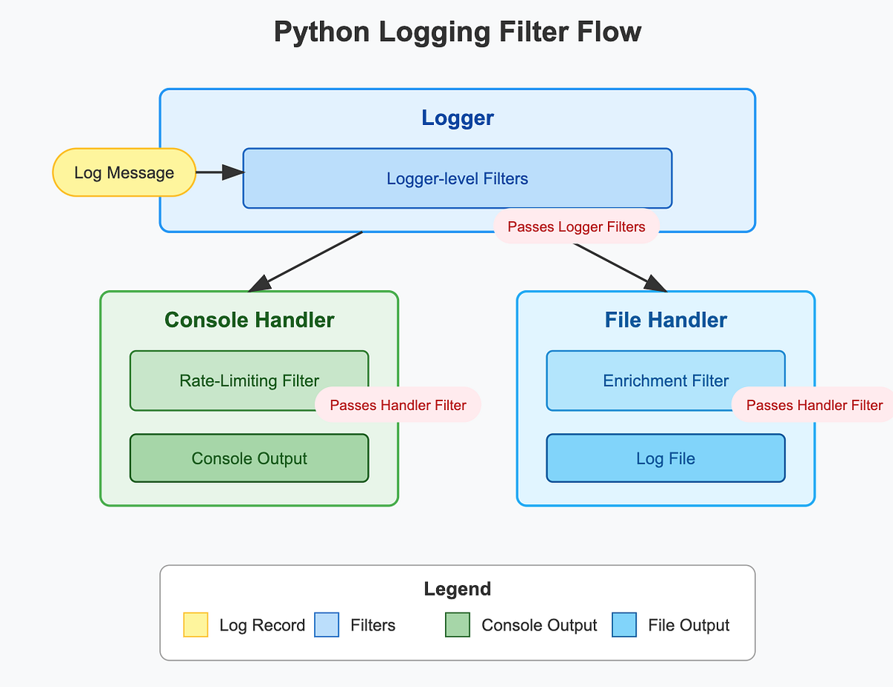

# Logging (user facing)

This should entirely focus on the user side. How logigng works, and then how to use the stuff in daqptyools

---
Updates as of mid February

# Logging for Python in DUNE-DAQ

Welcome, fellow logging enthusiast! This page provides a user's guide to how logging is done in Python in the context of DUNE-DAQ. 

## Basics

The bulk of the loggign functionality in drunc and other Python applications is built off the cool [Python logging framework](https://docs.python.org/3/library/logging.html), with its mission defined below:

> This module defines functions and classes which implement a flexible event logging system for applications and libraries.

It is worth a read to understand how logging works in Python, however the salient points are covered below.

In general, the built in logging module allows for producing severity-classified diagnostic events, which can be filtered, formatted, or routed as necessary. These logs automatically contain useful information including the timestamp, module, and context of the message. 

The core object of the logging functionality in Python is the logger. A logging instance, `log`, can be initialised as follows. The phrase "Hello, World!" is used as an input to the logger, with this message being bundled up by other useful information, including the severity level, to form whats known as a LogRecord. This record will then be transmitted as required. 

```python
import logging
log = logging.getLogger("Demo")
log.warning("Hello, world!")

>> Hello, World!
```

### Severity levels

Every record has an attached severity level, which can be used to flag how important a log record is. By default, Python has 5 main levels and one 'notset' level as shown in the image below[^1]:


[^1]: more can be defined as required, see Python's logging manual.

Each logging instance can have an attached severity level. If it has one, then only records that have the same severity level or higher will be transmitted.

```python
import logging
log = logging.getLogger("Demo", level = logging.WARNING)

log.info("This will not print")
log.warning("This will print")

>> This will print
```

### Handlers

Handlers are a key concept of logging in Python, as they control how the records are processed and formatted. There are several default one that the DAQ uses, and there are also several ones that are custom defined for the purposes of the DAQ. 

The example below shows an example of a file handler, a stream handler, and a webhook handler. As can be seen, each of the records are processed and formatted by each of the handlers and transmitted in each of their respective ways.


Importantly, each handler can have its own associated severity level! In the example above, it is certainly possible to have the WebHookHandler to only transmit if a record is of the level Warning or higher.


### Filters
A sidegrade and important add on for the loggers is the filters, whos primary purpose is to decide if an error should be transmitted or not. Filters can be attached to both the logger instance as well as any handlers attached to the logger instance itself. 

When a log record arrives, it will first be processed by the filters attached to the loggers first. Should they pass, the record is then passed onto each handler as shown before, where they are then further processed by each handler's attached filters. Only when they pass will a log be record be transmitted.



### Inheritance

Another key part of logging in Python is the inheritance feature. Loggers are organised in a heirarchical fashion and so it is possible to initialise descendant loggers by chaining the names together with a period, such as "root.parent.child". 

By default, loggers will inheret certain properties of the parent:
- severity level of the logger 
- handlers (and all attached properties, including severity level and filters on handlers)


Note that a particular exceptoin is that they _don't_ inheret any filters attached to the logger itself. 

A useful diagram to peruse is the [logging flow in the official docs](https://docs.python.org/2/howto/logging.html#logging-flow).


# Daqpytools

## Initialising a handler

## Subsec of existing handlers, filters, and walkthrough


### Advanced logging


#### Context

#### Handler streams


#### Log Handler Conf


#### Using ERS


## Basic info
basically see your presentation

- the basics of python logging
- handlers
- inheritance
- log levels

## User story
And then talk about the features in daqpytools as a user

- Best practices on initialising loggers
- How to deal with handlertypes
- How to deal with handlerconf 
- integratoin with ers

## Advanced handlers (WIP as of Dec 2025)

Aside from the core set of loggers and handlers defined natively in drunc, there are several other configurations that interplay with drunc. These can be best thought of as 'streams' which in interact with several other handlers. 


The native implementation in drunc is referred to as the 'base' stream and interacts with the three core handlers already discussed. 
Other streams include the 'Opmon' stream interacting with its own set of handlers, and the 'ERS' stream that interacts with different handlers based on the log message's severity level. 

The 'ERS' configuration is configured in OKS ([for example here](https://github.com/DUNE-DAQ/daqsystemtest/blob/974965be6e96aff969c69a380ed34aa96705e802/config/daqsystemtest/ccm.data.xml#L189)), and are automatically parsed by drunc and daqpytools as they get used. 

To deal with the constraints set above, a handler configuration dataclass is constructed to define the relevant configurations and a system of filters is initialised with every handler. When passing a log record that needs to be processed via a specific stream, the log record and the handler configuration is passed to the relevant logger, after which it is processed. 


## Dev story


