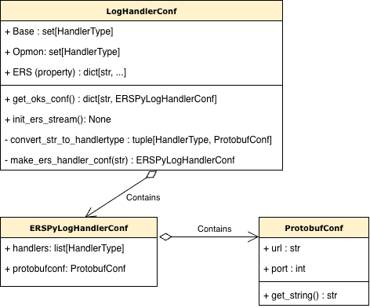

# Logging for Developers

This page walks through how daqpytools logging actually works under the hood. It's meant for folks adding new handlers, filters, or debugging routing issues.

If you're just using the logging API, check out:
- `docs/Logging.md` (user quickstart)
- `docs/Logging_advanced.md` (advanced patterns)

For specific extension recipes (new handler? new filter?), see `docs/dev_docs_extension.md`.

---

## The core idea

In the context of controlling which records to transmit, the logging system's job is to answer one question for every log record:

> **Should this specific handler transmit this specific record right now?**

Everything (registries, strategies, filters, specs) exists to answer that question consistently and without hardcoding destination logic into handler classes. 

### General framework

The overall framework is as follows:

- **Handlers only know *how* to emit** (file, terminal, kafka). They don't know *if* they should.
- **Records carry metadata** about where they want to go (in `extra["handlers"]`).
- **Filters (with their strategy) decide eligibility** using that metadata + fallback rules.

This creates a few nice properties:

1. You can change routing per-message without touching config or logger setup.
2. Global defaults stay consistent even when metadata isn't present.
3. New handlers/filters can be added without rewriting decision logic in existing code.

### A model for how handler and the messages interact

Think of it as two sets that need to overlap:

- **Handler capability set**: "I'm a RichHandler, so I can handle RichHandler messages" (represented as `HandlerType` values)
- **Record request set**: "This record wants to go to [Rich, File, Throttle]" (resolved from metadata or defaults)

A handler emits if these overlap:

```
emit if (handler_ids ∩ allowed_handlers) is non-empty
```
It will therefore emit if there is an overlap.

The above is the general idea of how everything should work. The code is therefore there to ensure that the above model works as expected. 


---

## Code walkthrough 

This section defines the core components without diving into their interactions yet.

### HandlerTypes

`HandlerType` is an enum defined in `handlerconf.py`. It represents anything that can be attached to a logger at the top level. This includes:

- **Output handlers**: `Rich`, `File`, `Lstdout`, `Lstderr`, `Protobufstream`, `Stream` (which is a composite of stdout/stderr)
- **Logger-level filters**: `Throttle` (logger-attached throttling filter)

Important: `HandleIDFilter` is **not** a `HandlerType`. It's an internal filter attached to each handler to enforce routing decisions.

Every `HandlerType` is a contract. When you use it:

- It's defined as an enum value in `handlerconf.py`
- It has a corresponding `HandlerSpec` or `FilterSpec` in a registry
- Records can request it via `extra={"handlers": [HandlerType.Rich, ...]}`
- Handlers are identified by their `HandlerType` when filtering decides whether to emit

When adding a new handler, pick a `HandlerType` first. Everything else flows from that token.

### StreamType

`StreamType` is another enum in `handlerconf.py`. It marks which logical stream a record belongs to:

- `BASE` (normal/default routing)
- `OPMON` (monitoring/opmon-related output)
- `ERS` (Error Reporting System routing)

By default, records route according to `extra["handlers"]` or fallback. But if a record is marked `extra={"stream": StreamType.ERS}`, then `StreamAwareAllowedHandlersStrategy` dispatches to ERS-specific routing logic instead.

This is extensible: you can add new `StreamType` values and teach the strategy dispatcher how to handle them.

### Specs

Defined in `specs.py`, there are two types:

**`HandlerSpec`** describes how to build a handler:
- `alias`: The `HandlerType` key
- `handler_class`: The runtime handler class (used to detect existing instances)
- `factory`: A callable that builds the handler from configuration
- `fallback_types`: Which `HandlerType` values this handler represents for routing purposes
- `target_stream`: Optional (for stream-specific handlers like stdout vs stderr)

**`FilterSpec`** describes how to build a logger-level filter:
- `alias`: The activation `HandlerType` token
- `filter_class`: The runtime filter class
- `factory`: A callable that builds the filter
- `fallback_types`: Default handler types for the filter

Specs are the "source of truth" for what a handler or filter is. When setup code needs to build something, it looks up the spec in a registry.


### HandleIDFilter


`HandleIDFilter` is the core enforcement mechanism. Each handler gets one attached to it.

Its job: "Should **this specific handler** emit this record?"

How it works:

1. It knows which handler it's attached to via `handler_ids` (a set of `HandlerType` values)
2. For each record, it calls the routing strategy to get the `allowed_handlers` set (resolved from `extra["handlers"]` or fallback)
3. It emits if `handler_ids ∩ allowed_handlers` is non-empty

This implements the set intersection logic from the core idea section. It's the enforcement point where the handler capability set meets the record request set.

### Routing strategies

Defined in `routing.py`, strategies answer: "What `HandlerType` values are allowed for this record?"

**`AllowedHandlersStrategy`** is the abstract base. Implementations:

1. **`DefaultAllowedHandlerStrategy`**: 
   - Uses `record.handlers` if present (explicit routing metadata)
   - Falls back to `fallback_handlers` set if `record.handlers` is absent or None

2. **`ERSAllowedHandlersStrategy`**:
   - Reads `record.ers_handlers` dict and `record.levelno` (Python log level)
   - Maps the level to an ERS severity variable using `level_to_ers_var`
   - Returns the handler set for that severity

3. **`StreamAwareAllowedHandlersStrategy`**:
   - Looks at `record.stream`
   - If `stream == StreamType.ERS`, uses `ERSAllowedHandlersStrategy`
   - Otherwise uses `DefaultAllowedHandlerStrategy`
   - This is the primary strategy used by default

The key insight: strategies are pluggable. Different record types can use different resolution logic without changing filter code.

### Fallback handlers

**This is the number-one misunderstanding.** Fallback is not a "if all else fails" mechanism. It's the **default routing policy**.

Each handler gets a `fallback_types` set from its `HandlerSpec` (what it defaults to emitting). When you attach a handler, you can override this with `fallback_handler` parameter. Here's how it works in practice:

```python
# Start with a clean logger (no handlers)
from daqpytools.logging import add_handler, HandlerType, get_daq_logger
log = get_daq_logger(
    "myapp",
    log_level="INFO",
    rich_handler=False,      # deliberately don't add handlers, we'll do it manually
    stream_handlers=False,
)

# Attach Rich handler with its spec's default fallback (Rich)
add_handler(log, HandlerType.Rich, use_parent_handlers=True)
# Rich handler's fallback now = [HandlerType.Rich] (from spec)

# Record 1: no explicit handlers → uses fallback
log.info("Rich only")  # Emits because Rich is in Rich's fallback

# Attach Lstderr with fallback = Unknown (won't emit by default)
add_handler(
    log, 
    HandlerType.Lstderr, 
    use_parent_handlers=True,
    fallback_handler={HandlerType.Unknown}  # Override! Now Lstderr won't emit unless explicitly requested
)

# Record 2: standard message → only Rich emits
log.critical("Still just rich")  # Lstderr drops it (Unknown not in allowed set)

# Record 3: explicit request → both emit
log.critical("Both now", extra={"handlers": [HandlerType.Rich, HandlerType.Stream]})
```

The key insight: each handler has its own fallback set, set when the handler is attached. Records check against that fallback (via `HandleIDFilter`) unless `extra["handlers"]` overrides it.

This feature is incredibly useful in suppressing ERS related handlers when they are not requested for. 

If routing isn't what you expect, debug:

1. Does the record have explicit `extra["handlers"]`?
2. If not, what's the fallback set?

### Handler and Filter Registries

The registries live in `handlers.py` and `filters.py`:

- `HANDLER_SPEC_REGISTRY`: Dictionary mapping `HandlerType` → `HandlerSpec`
- `FILTER_SPEC_REGISTRY`: Dictionary mapping `HandlerType` → `FilterSpec`

These are the "catalog" of all available handler and filter types. When `add_handler(log, HandlerType.Rich)` is called, setup code:

1. Looks up `HandlerType.Rich` in `HANDLER_SPEC_REGISTRY` (`FILTER_SPEC_REGISTRY` for filters)
2. Calls the factory function to build the handler
3. Attaches the `HandleIDFilter` with the handler's `fallback_types`
4. Installs it on the logger

Registries prevent duplicate handlers and centralize construction logic.

### LogHandlerConf

Defined in `handlerconf.py`, this dataclass holds the various streams and their handler configurations.

Key attributes:

- `BASE_CONFIG`: Default handlers for normal (non-ERS, non-OPMON) logging
- `OPMON_CONFIG`: Handlers for OPMON-related output
- `ERS`: ERS severity-specific configurations (loaded from environment variables)

`LogHandlerConf` also defines `StreamType` and parses ERS environment variables:

```python
DUNEDAQ_ERS_ERROR="throttle,lstdout,protobufstream(monkafka.cern.ch:30092)"
DUNEDAQ_ERS_WARNING="..."
# etc.
```

These are parsed into `ERSPyLogHandlerConf` objects that hold the handler list and optional protobuf endpoint for each severity.




## Interactions

### Logger initialisation flow

When you build a logger and need to determine which handlers should be attached:

1. **You call** `get_daq_logger(...)` with flags like `rich_handler=True`, `stream_handlers=True`, etc.
2. **Logger setup** resolves which handlers to attach based on your flags
3. **For each handler type**, setup:
   - Looks it up in `HANDLER_SPEC_REGISTRY` and `FILE_SPEC_REGISTRY`
   - Calls the factory function to build it
   - Attaches a `HandleIDFilter` with the handler's routing identity
   - Installs it on the logger
4. **The fallback set** is composed from all enabled handlers. This becomes the default allowed set for records that don't carry explicit `extra["handlers"]`.

If you add ERS handlers via `setup_daq_ers_logger(...)`, the process is similar but with a critical difference:

1. **ERS env variables** are parsed (e.g., `DUNEDAQ_ERS_ERROR=...`)
2. **Handler types are extracted** from each severity's config (e.g., `throttle`, `lstdout`, `protobufstream(...)`)
3. **Handlers are built and attached** with `fallback_handler={HandlerType.Unknown}`
   - This is the key: ERS handlers **won't emit by default**
   - They only emit when explicitly requested by ERS severity routing (see `ERSAllowedHandlersStrategy`)
   - This prevents accidental spillover into standard logging
4. **Records are routed to ERS handlers only via ERS severity mapping**
   - A record marked `extra={"stream": StreamType.ERS}` triggers ERS-aware routing
   - The routing strategy maps Python level → ERS severity variable → handler set


### Record flow

When you call `log.info("something")`, here's the actual flow:

1. **Python's logging creates a `LogRecord`** with your message, severity, and any `extra` metadata

2. **Logger-level filters run first** (e.g., `ThrottleFilter`):
   - If any filter returns `False`, the record stops here
   - It never reaches handlers
   - This is where global concerns like throttling happen

3. **Record is offered to each attached handler**

4. **Each handler's `HandleIDFilter` decides** whether to emit:
   - The filter calls the routing strategy to resolve `allowed_handlers`:
     - If `extra["handlers"]` is present, use it
     - Otherwise use the fallback set
     - If `stream == StreamType.ERS`, use ERS-specific routing
   - The filter checks: `handler_ids ∩ allowed_handlers`
   - Non-empty = emit; empty = drop the record

5. **Format and emit** (if the record passed the filter):
   - The handler formats it and emits (to file, stdout, kafka, etc.)

This two-stage filtering is key: logger-level filters decide "should ANY handler see this?" while handler-level filters decide "should THIS handler see this?"


---

## Debugging checklist

When logs appear wrong or not at all, use this workflow:

1. **What handlers are attached?**
   ```python
   print(log.handlers)  # List all handlers
   for h in log.handlers:
       print(f"{h}: filters={h.filters}")  # Check their filters
   ```

2. **What's the allowed set for your record?**
   - Does it have explicit `extra={"handlers": [...]}`?
   - If not, what's the fallback set from logger setup?
   - If `stream == StreamType.ERS`: Is the severity level mapped? (DEBUG doesn't map)

3. **Do handler IDs match?**
   - Each handler has a `HandleIDFilter` with `handler_ids` set
   - Is that set in the allowed set?
   - If not, the record is silently dropped

4. **Are logger-level filters rejecting it?**
   - Less common, but `ThrottleFilter` might suppress repeated messages
   - Check filter state and condition

5. **For ERS specifically:**
   - Env vars set and properly formatted?
   - Severity level mapped correctly?
   - Verify handler appears in the resolved allowed set

If all else fails, add debug statements in `HandleIDFilter.filter()` to print `handler_ids`, `allowed`, and the intersection result.

---

## Next steps

See `docs/dev_docs_extension.md` for:

- Adding new handlers
- Adding new logger-level filters
- Debugging/verification checklist
