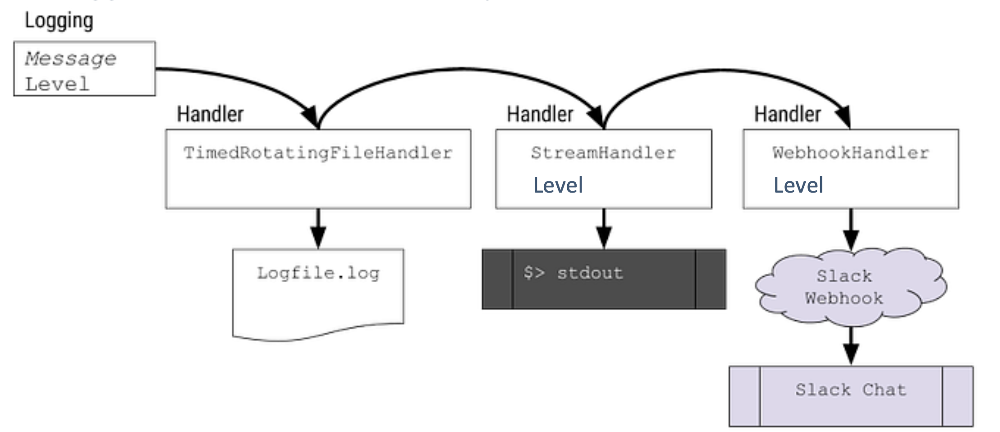

# Logging for Python in DUNE-DAQ
Updated as of 5.6.0

Welcome, fellow beavers! This page provides a user guide to logging in Python in the context of DUNE-DAQ.

## Contents

- **TL;DR** — Quick setup and basic usage
- **Basics** — Core _Python_ logging concepts (severity levels, handlers, filters, inheritance)
- **Using logging with daqpytools** — How to initialize and use loggers with the framework defined in daqpytools

If you are introducing logging to your Python repo, or are in the process of upgrading your logging implementation , **please** read the logging best practices! These will give you useful tips and tricks on how the logging framework should be implemented and will prevent future heartache. See `docs/Logging_best_practices.md`. 


For advanced routing and expert configuration patterns, see `docs/Logging_advanced.md`.

## TL;DR

#### Initialise

```python
from daqpytools.logging import get_daq_logger
test_logger = get_daq_logger(
    logger_name = "test_logger", # Set as your logger name. Preferrably it should be relevant to what module / file you are in 
    log_level = "INFO", # Default level you will transmit at or above. In this case, Debugs will not be transmitted
    use_parent_handlers = True, # Just keep this true
    
    ## the rest are whatever handlers you want to attach. Read on for what exists. Rich is your standard TTY logger so the vast majority will be using this
    rich_handler = True, 
    stream_handlers = False # you dont really need this; its False by default
)
```

For now, **please see the docstring of `get_daq_logger` to see what stuff you can have and what to initialise with**


#### Use 

```python
test_logger.info("Hello, world!")

test_logger(
        "[dim cyan]Look[/dim cyan] "
        "[bold green]at[/bold green] "
        "[bold yellow]all[/bold yellow] "
        "[bold red]the[/bold red] "
        "[bold white on red]colours![/bold white on red] "
)
```


## Basics

The bulk of the logging functionality in drunc and other Python applications is built on the [Python logging framework](https://docs.python.org/3/library/logging.html), with its mission defined below:

> This module defines functions and classes which implement a flexible event logging system for applications and libraries.

It is worth reading to understand how logging works in Python; the salient points are covered below.

In general, the built-in logging module allows producing severity-classified diagnostic events, which can be filtered, formatted, or routed as necessary. These logs automatically contain useful information including timestamp, module, and message context.

The core object in Python logging is the logger. A logging instance, `log`, can be initialized as follows. The phrase "Hello, World!" is bundled with other useful metadata, including severity level, to form a `LogRecord`, which is then emitted as required.

```python
import logging
log = logging.getLogger("Demo")
log.warning("Hello, world!")

>> Hello, World!
```

### Severity levels

Every record has an attached severity level, which can be used to flag how important a log record is. By default, Python has 5 main levels and one 'notset' level as shown in the image below[^1]:


[^1]: more can be defined as required, see Python's logging manual.

Each logging instance can have an attached severity level. If it has one, then only records that have the same severity level or higher will be transmitted.

```python
import logging
log = logging.getLogger("Demo", level = logging.WARNING)

log.info("This will not print")
log.warning("This will print")

>> This will print
```

### Handlers

Handlers are a key concept in Python logging, since they control how records are processed and formatted. DAQ uses several standard handlers as well as custom handlers.

The image below shows a file handler, a stream handler, and a webhook handler. Each record is processed and formatted by each handler and then transmitted through that destination.



Importantly, each handler can have its own associated severity level! In the example above, it is certainly possible to have the WebHookHandler to only transmit if a record is of the level Warning or higher.


### Filters
Filters are an important add-on for loggers, and their primary purpose is to decide whether a record should be transmitted. Filters can be attached to both a logger instance and its handlers.

When a log record arrives, it is first processed by filters attached to the logger. If it passes, the record is then passed to each handler and processed again by that handler's filters. A record is emitted only if those checks pass.


### Inheritance

Another key part of Python logging is inheritance. Loggers are organized hierarchically, so you can initialize descendant loggers by chaining names with periods, such as "root.parent.child".

By default, loggers inherit certain properties from the parent:
- severity level of the logger 
- handlers (and all attached properties, including severity level and filters on handlers)


Note one exception: they _do not_ inherit filters attached directly to the parent logger itself.

A useful diagram is the [logging flow in the official Python 3 docs](https://docs.python.org/3/howto/logging.html#logging-flow).


## Using logging with daqpytools

The [daqpytools](https://github.com/DUNE-DAQ/daqpytools) package contains several quality-of-life improvements for DAQ Python tooling, including logging utilities.

These include:
- standardised ways of initialising top-level 'root' loggers
- constructors for default logging instances
- many bespoke handlers 
- filters relevant to the DAQ
- handler configurations


A lot of these features can be demonstrated via the logging demonstrator functionality. With the DUNE environments loaded, simply run 

```
daqpytools-logging-demonstrator
```

and view the help string to learn more, and view the script itself in the repository to see how it is implemented. 


### Initializing a logger

Initializing a logger instance is simple:

```python
from daqpytools.logging import get_daq_logger
test_logger = get_daq_logger(
    logger_name = "test_logger",
    log_level = "INFO",
    use_parent_handlers = True,
    rich_handler = True,
    stream_handlers = False
)

test_logger.warning("Hello, world!")
```

As shown above, initializing a logger with specific handlers is as easy as changing constructor flags.

For now, **please see the docstring of `get_daq_logger` to see what stuff you can have and what to initialise with**


The core philosophy of the logging framework in daqpytools is that each logger should only have _one_ instance of a specific type of logger. This means that while a single logger can have both a Rich and a Stream handler, a single logger cannot have _two_ Rich handlers to prevent duplicating messages.


Please refer to the docstrings for the most up to date definitions on the options and what handlers may or may not be included. There are some exceptions which are clearly labelled in the document. Choosing which handler to trigger on a per-message instance is an advanced feature of logging in DUNE-DAQ, so please refer to the advanced section of this guide. 

Alternatively, it is possible to add handlers to an existing DAQ logger instance. Please also refer to the advanced section of this guide.


### Walkthrough of existing handlers and filters

As seen in the previous section, there are several handlers and filters available in daqpytools. What follows is a short description of each, with quick examples. For complete details, refer to docstrings and the logging demonstrator.

Remember that by default, any messages received by the logger will be transmitted to _all_ available handlers that are attached to the logger. 

**For now, please view both `get_daq_logger` and the relevant builders in `handlers.py` and `filters.py` to see what options exist on how to initialise them.**

**In the future, this will be automatically generated from the docstrings**


#### Rich handler

The Rich handler should be the 'default' handler for any messages that should be transmitted in the terminal. This handler has great support of colors, and delivers a complete message out to the terminal to make it easy to view and also trace back to the relevant message. 


#### File handler

As the name suggests, the file handler is used to transmit messages directly to a log file. Unlike stream and rich handlers, instead of defining a boolean in the constructor the user must supply the _filename_ of the target file for the messages to go into.


#### Stream handlers

Stream handlers are used to transmit messages directly to the terminal without any color formatting. This is of great use for the logs of the controllers in drunc, which has its own method of capturing logs via a capture of the terminal output and a pipe to the relevant log file. 

Note that stream handling consists of two handlers, one writing to `stdout` and one to `stderr`. The `stderr` stream emits only for records at `ERROR` or above.


#### ERS Kafka handler

The ERS Kafka handler is used to transmit ERS messages via Kafka, which is incredibly useful to show on the dashboards messages as they happen. 

This handler is not included in the default emit set. Extra configuration is required; for example:

```python
import logging

from daqpytools.logging import HandlerType, get_daq_logger

main_logger: logging.Logger = get_daq_logger(
    logger_name="daqpytools_logging_demonstrator",
    ers_kafka_session="session_tester"
)

main_logger.error(
    "ERS Message",
    extra={"handlers": [HandlerType.Protobufstream]} 
)
```

See the advanced section for more details.


**Notes**
At the moment, by default they will be sent via the following:
```
session_name: session_tester
topic: ers_stream
address: monkafka.cern.ch:30092
```


#### Throttle filter

There are times when an application decides to send a huge amount of logs of a single message in a very short time, which can overwhelm the systems. When such an event occurs, it is wise to throttle the output coming out. 

The throttle filter replicates the same logic that exists in the ERS C++ implementation, which dynamically limits how many messages get transmitted. The filter is by default attached to the _logger_ instance, with no support for this filter being attached to a specific handler just yet. 

Initializing the filter takes two arguments:
 - `initial_treshold`: number of initial occurrences to let through immediately
 - `time_limit`: time window in seconds for resetting state

The basic logic is as follows. 

1. The first N messages will instantly get transmitted, up to `initial_treshold`
2. The next 10 messages will be suppressed, with the next single message reported at the end
3. The next 100 messages will be suppressed, with the next single message reported at the end
4. This continues, with the threshold increasing by 10x each time
5. After `time_limit` seconds after the last message, the filter gets reset, allowing messages to be sent once more


For the throttle filter, a 'log record' is **uniquely** defined by the record's pathname and linenumber. Therefore, 50 records that contain the same 'message' but defined in different line numbers in the script will not be erroneously filtered.


An example is as follows:

```python
import time

from daqpytools.logging import HandlerType, get_daq_logger

main_logger: logging.Logger = get_daq_logger(
    logger_name="daqpytools_logging_demonstrator",
    stream_handlers=True,
    throttle=True
)

emit_err = lambda i: main_logger.info(
    f"Throttle test {i}",
    extra={"handlers": [HandlerType.Rich, HandlerType.Throttle]},
)

for i in range(50):
    emit_err(i)
main_logger.warning("Sleeping for 30 seconds")
time.sleep(30)
for i in range(1000):
    emit_err(i)
```

Which will behave as expected.

 

**Note**
By default, throttle filters obtained via `get_daq_logger` are initialized with an `initial_treshold` of 30 and a `time_limit` of 30.

**Note**
Similarly to the ERS Kafka handler, this filter is not enabled by default, hence requiring the use of HandlerTypes. See the Advanced section for more info.
