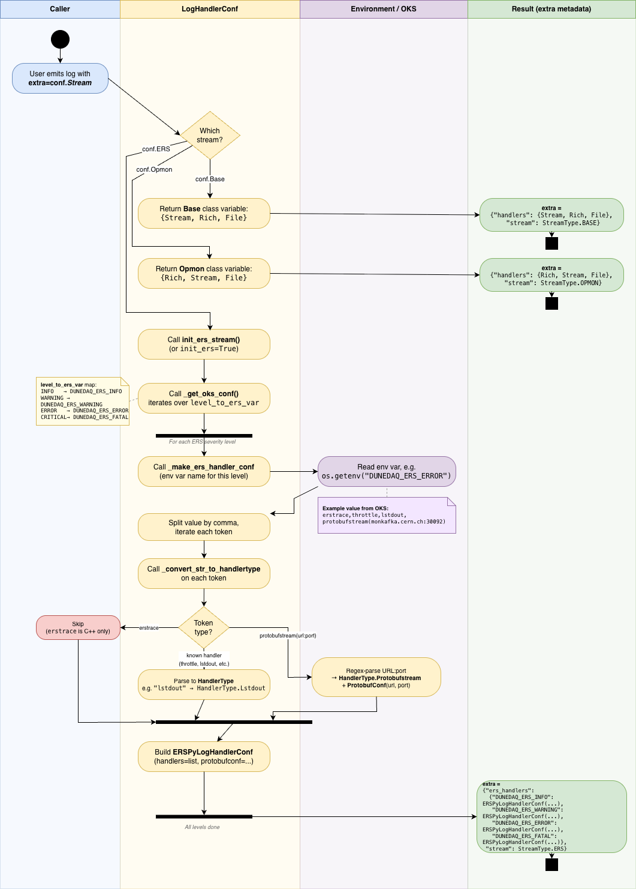
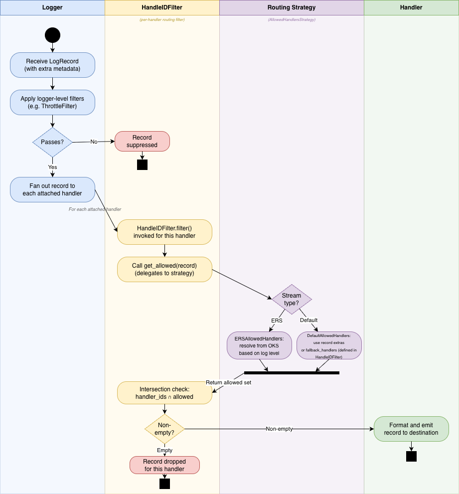

# Architecture reference: initialization and record flow

This page documents the runtime behaviour of the logging system — how loggers are initialised and how records flow through the system.

For the static structure of components (HandlerType, Specs, Filters, Strategies), see the [developer explanation](../explanation.md).

---

## Logger initialisation flow

When you build a logger and need to determine which handlers should be attached:

1. **You call** `get_daq_logger(...)` with flags like `rich_handler=True`, `stream_handlers=True`, etc.
2. **Logger setup** resolves which handlers to attach based on your flags
3. **For each handler type**, setup:
   - Looks it up in `HANDLER_SPEC_REGISTRY` and `FILE_SPEC_REGISTRY`
   - Calls the factory function to build it
   - Attaches a `HandleIDFilter` with the handler's routing identity
   - Installs it on the logger
4. **The fallback set** is composed from all enabled handlers. This becomes the default allowed set for records that don't carry explicit `extra["handlers"]`.

If you add ERS handlers via `setup_daq_ers_logger(...)`, the process is similar but with a critical difference:

1. **ERS env variables** are parsed (e.g., `DUNEDAQ_ERS_ERROR=...`)
2. **Handler types are extracted** from each severity's config (e.g., `throttle`, `lstdout`, `protobufstream(...)`)
3. **Handlers are built and attached** with `fallback_handler={HandlerType.Unknown}`
   - This is the key: ERS handlers **won't emit by default**
   - They only emit when explicitly requested by ERS severity routing (see `ERSAllowedHandlersStrategy`)
   - This prevents accidental spillover into standard logging
4. **Records are routed to ERS handlers only via ERS severity mapping**
   - A record marked `extra={"stream": StreamType.ERS}` triggers ERS-aware routing
   - The routing strategy maps Python level → ERS severity variable → handler set

---

## Record flow

When you call `log.info("something")`, here's the actual flow:

1. **Python's logging creates a `LogRecord`** with your message, severity, and any `extra` metadata

2. **Logger-level filters run first** (e.g., `ThrottleFilter`):
   - If any filter returns `False`, the record stops here
   - It never reaches handlers
   - This is where global concerns like throttling happen

3. **Record is offered to each attached handler**

4. **Each handler's `HandleIDFilter` decides** whether to emit:
   - The filter calls the routing strategy to resolve `allowed_handlers`:
     - If `extra["handlers"]` is present, use it
     - Otherwise use the fallback set
     - If `stream == StreamType.ERS`, use ERS-specific routing
   - The filter checks: `handler_ids ∩ allowed_handlers`
   - Non-empty = emit; empty = drop the record

5. **Format and emit** (if the record passed the filter):
   - The handler formats it and emits (to file, stdout, kafka, etc.)

This two-stage filtering is key: logger-level filters decide "should ANY handler see this?" while handler-level filters decide "should THIS handler see this?"

